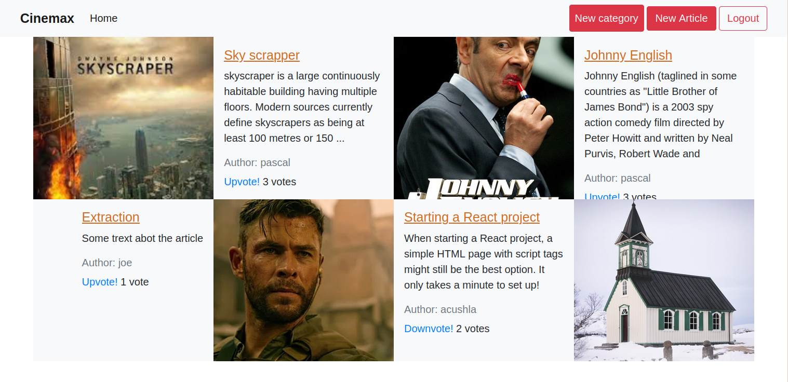

# Cinemax 
Cinemax is a web apllication i built using ruby on rails where the Authenticated user;
  - can create articles categories
  - can create articles and link those articles to many categories
  - can vote an article
- The homepage shows a featured article (which has the biggest number of votes), and the list of  all the categories in order of priority
- The category page show all the articles for a category
- The articles page shows all the articles

## Project screenshot



## 🔨 Built with

- Ruby on Rails 6.1.3
- Ruby 2.7.1
- Bootstrap 4
- rubocop linters
- rspec
- Vs code

## Live Demo

[See demo ](https://cinemaxxx.herokuapp.com/)

## Video Link

 [Presentation](https://www.loom.com/share/82f90d9fe9864bea8b4ec29dde0f660f)

## To run the project  locally

Fork or clone the repository from here
```
 git clone https://github.com/Byabasaija/Cinemax.git
```
 Open terminal and navigate to root directory.

Run these commands;
```
bundle install
```

```
rails db:create
```
```
rails db:migrate
```

```
rails s
```
Then visit [localhost:3000](http://locahost:3000)


## How to run the test suite

I added validations tests and association tests for all models.
1 added also integration tests for authentication and category creation
Run these tests with those commands:

### unit tests
```
 rspec spec/user_spec.rb`
 rspec spec/category_spec.rb`
 rspec spec/article_spec.rb`
 rspec spec/vote_spec.rb`
```

### integration tests
```
rspec spec/features/authentication_spec.rb
rspec spec/features/new_category_spec.rb`
```

## 👨🏽‍ Creator

👤 **Pascal**

- Linkedin: [Pascal Byabasaija](https://www.linkedin.com/in/pascal-byabasaija/)
- Github: [@Byabasaija](https://github.com/Byabasaija)
- Twitter: [@byabashaijapoet](https://twitter.com/byabashaijapoet)

## Acknowledgement

Design idea by Nelson Sakwa in Behance

## 🤝 Contributing

Contributions, issues and feature requests are welcome!

## Show your support

Give a ⭐️ if you like this project!

## 📝 License

