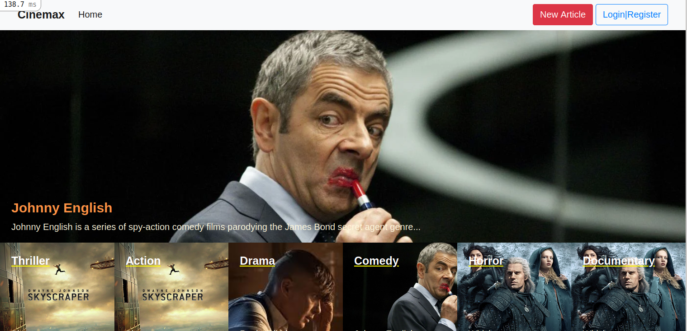

# Cinemax 
Cinemax is a web apllication i built using ruby on rails where the Authenticated user;
  - can create articles categories
  - can create articles and link those articles to many categories
  - can vote an article
- The homepage shows a featured article (which has the biggest number of votes), and the list of  all the categories in order of priority
- The category page show all the articles for a category
- The articles page shows all the articles

## Project screenshot

## 🔨 Built in

- Ruby on Rails 6.1.3
- Ruby 2.7.1
- Bootstrap 4
- rubocop linters
- rspec
- Vs code

## Live Demo

[See demo ]()

## Video Link

 [Presentation]()

## To run the project in local

- clone the repository from here [repo link](https://github.com/Byabasaija/Cinemax.git)
- Open terminal and navigate to root folder (/lifestyle-app).
- Once in root folder
  - type: `rails s` in terminal and in browser
  - run `bundle install`
  - run `yarn install`
  - run`rails db:create`
  - run `rails db:migrate`
  - type localhost:3000/ in address bar.

## How to run the test suite

I added validations tests for all models.
1 added also integration tests for authentication and category creation
Run these tests with those commands:

### unit tests
- `rspec spec/user_spec.rb`
- `rspec spec/category_spec.rb`
- `rspec spec/article_spec.rb`
- `rspec spec/vote_spec.rb`

### integration tests
- `rspec spec/features/authenticate_user_spec.rb`
- `rspec spec/features/create_category_spec.rb`

## 👨🏽‍ Creator

👤 **Pascal**

- Linkedin: [Pascal Byabasaija](https://www.linkedin.com/in/pascal-byabasaija/)
- Github: [@Byabasaija](https://github.com/Byabasaija)
- Twitter: [@byabashaijapoet](https://twitter.com/byabashaijapoet)

## Acknowledgement

I have followed the [design](https://www.behance.net/gallery/14554909/liFEsTlye-Mobile-version) given by [Nelson Sakwa](https://www.behance.net/sakwadesignstudio) in Behance

## 🤝 Contributing

Contributions, issues and feature requests are welcome!

## Show your support

Give a ⭐️ if you like this project!

## 📝 License

This project is no licensed.
